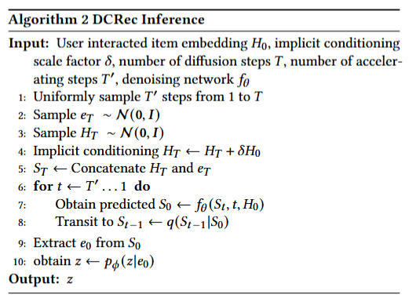

# DCRec

This is the implementation of the WSDM 2026 paper:
> [Dual Conditional Diffusion Models for Sequential Recommendation](https://arxiv.org/abs/2410.21967)


## Reproduce the results

### Amazon Beauty Data

```
python -u main.py --data amazon_beauty  --timesteps 50  --mode train  --loss_type mix  --lr 0.004  --hidden_factor 128 --batch_size 512 --num_block 4  --dropout_rate 0.1
```

### DCRec Training Process


### DCRec Inference Process


### Dataset Overview


If you find this work helpful, please cite:
```bibtex
@article{huang2024dual,
  title={Dual conditional diffusion models for sequential recommendation},
  author={Huang, Hongtao and Huang, Chengkai and Yu, Tong and Chang, Xiaojun and Hu, Wen and McAuley, Julian and Yao, Lina},
  journal={arXiv preprint arXiv:2410.21967},
  year={2024}
}
